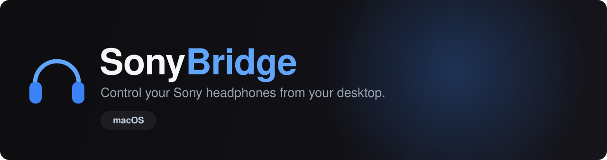

<div align="center">



<br/>

**An unofficial, open-source macOS menu bar app for Sony headphones — Noise Cancelling, Ambient Sound, EQ, DSEE and battery, without the phone.**

<br/>

[](https://github.com/AmitRajput-Dev/SonyBridge/actions/workflows/build.yml)
[](LICENSE)


<br/>

**[Features](#-features)** · **[Install](#-install)** · **[Usage](#-usage)** · **[Supported headphones](#-supported-headphones)** · **[Build from source](#-build-from-source)** · **[Contributing](#-contributing)** · **[Credits](#-credits)**

<br/>

*Screenshots of the menu bar app are coming — for now, see the [Usage](#-usage) section below for what to expect.*

</div>

---

## Why

Sony locks headphone settings behind their mobile-only *Sound Connect* app. If you live on a laptop,
you're stuck. SonyBridge talks to the headphones directly over Bluetooth RFCOMM using Sony's
reverse-engineered binary protocol — no phone required. It lives entirely in your macOS menu bar: no
Dock icon, no window, just a native menu.

The original [SonyHeadphonesClient](https://github.com/Plutoberth/SonyHeadphonesClient) only spoke Sony's
**first-generation** protocol, so newer headsets (WH-CH720N, XM4/XM5, WF-series, LinkBuds…) just timed
out on connect. SonyBridge adds full **second-generation ("v2") protocol** support and a native macOS
menu bar app, built with AppKit/SwiftUI.

## ✨ Features

**Sound modes**
- 🎚️ **Ambient Sound Control** — Noise Cancelling · Ambient Sound (with a 1–20 level slider (1–19 on older models) and a Focus on Voice switch) · Off
- 🔄 **Live button sync** — following the headset's own NC button live, even while the menu is open

**Equalizer**
- 🎛️ **Equalizer** — presets *and* a **Manual mode** with vertical sliders (5 bands + Clear Bass on older models). The **WH-1000XM6**'s 10-band equalizer is read and displayed, but changing it isn't available yet — its write format isn't verified, so the sliders are greyed out with a "coming soon" note

**Other settings** *(each shown only if your headset supports it)*
- ✨ **DSEE** — Sony's audio upscaling for compressed sources
- 🗣️ **Speak-to-Chat** and **Adaptive Volume**
- ⏱️ **Auto Power-Off** — Off, 5 min, 30 min, 1 hour, 3 hours, or when taken off

**Battery & info**
- 🔋 **Battery level** — live percentage, including **per-earbud + case** for TWS models
- 🎧 **About the Headphones** — firmware, codec, protocol, and Bluetooth address

**Automatic connection**
- 📍 **Lives in the menu bar** — a native macOS menu; the icon shows the current mode and dims when disconnected
- 🔌 **Connect Automatically** (on by default) — at launch and whenever your headset connects to the Mac
- 🔁 **Reconnect Automatically** (on by default) — retries if the control link drops while the headset is still connected, backing off from 3 s up to every 60 s
- 🚀 **Launch at Login** (off by default) — uses macOS Login Items

**Languages**
- 🌍 **English & French** — follows your macOS language

## 📥 Install

**Requirements:** macOS 13 or later, and the Xcode **Command Line Tools** (no full Xcode app needed):

```sh
xcode-select --install
```

Then:

```sh
git clone https://github.com/AmitRajput-Dev/SonyBridge.git
cd SonyBridge
make install
```

`make install` builds a release version, quits SonyBridge if it's running, and installs it to
`/Applications/SonyBridge.app`. Afterwards, launch it from Launchpad, Spotlight, or Finder.

> 💡 On first launch, macOS asks for **Bluetooth permission** — allow it, otherwise SonyBridge can't
> talk to your headphones. Pair and connect your headphones in macOS **Bluetooth settings** first.

**To update:** pull the latest changes and run `make install` again.

**To uninstall:** quit SonyBridge, then drag `/Applications/SonyBridge.app` to the Trash. If you turned
on **Launch at Login**, turn it off first (from the SonyBridge Options menu) so macOS doesn't keep a
stale login item around.

## 🕹️ Usage

Click the SonyBridge icon in the menu bar to open the menu. If nothing is connected yet, choose
**Connect…** — it uses the Sony headset already connected to macOS, or opens the macOS Bluetooth picker
if none is connected yet.

From the menu you can:
- switch **sound modes** (Noise Cancelling / Ambient Sound / Off) and, in Ambient Sound, adjust the level and Focus on Voice;
- pick an **Equalizer** preset or dial in a **Manual** curve;
- toggle **DSEE**, **Speak-to-Chat**, and **Adaptive Volume** (only the ones your model supports);
- set **Auto Power-Off**;
- check battery and firmware under **About the Headphones**;
- turn **Launch at Login**, **Connect Automatically**, and **Reconnect Automatically** on or off under **SonyBridge Options**;
- **Disconnect** (auto-reconnect stays off until the headset reconnects on its own or you click **Connect…** again) or **Quit SonyBridge** (⌘Q).

## 🎧 Supported headphones

| Status | Devices |
|--------|---------|
| ✅ **Verified** | WH-CH720N, Sony ULT WEAR (WH-ULT900N), WH-1000XM6 |
| 🟢 **Expected** (v2, over-ear — NC/Ambient/battery/EQ) | WH-1000XM5, WH-XB910N, WH-CH520 |
| 🟡 **v2 earbuds** (controls work; battery format differs) | WF-1000XM4, WF-1000XM5, WF-C700N, LinkBuds S |
| 🔵 **Legacy** (v1 protocol — NC/Ambient only) | WH-1000XM4, WH-1000XM3, WH-1000XM2, WH-XB900N, MDR-XB950BT |

> The Verified models are hardware-tested. Others share the same protocol family, so the basics should
> work — per-model quirks are untested. Reports and PRs for other devices are very welcome.
>
> On the **WH-1000XM6**, changing the equalizer in Manual mode is coming in a later update (reading its
> 10-band equalizer already works).

## 🚀 Build from source

Requires the **Xcode Command Line Tools** (`xcode-select --install`) — the full Xcode app is not needed.

```sh
git clone https://github.com/AmitRajput-Dev/SonyBridge.git
cd SonyBridge
make              # debug build → build/SonyBridge.app
make run          # builds and launches the app (add DEBUG=1 to log every protocol frame)
make test         # unit tests + translation check
make release      # universal (Apple Silicon + Intel) build, zipped to build/SonyBridge.zip
make clean        # remove build/
```

`make run DEBUG=1` logs every frame exchanged with the headphones to
`~/Library/Logs/SonyBridge/app.log` (`build/app.log` is a symlink to it).

> ⚠️ Always launch SonyBridge through `open`, Finder, or `make run`/`make install` — never by running
> `Contents/MacOS/SonyBridge` directly, or macOS's privacy protection can close the app.

## 🔬 How it works

Sony headphones expose a vendor RFCOMM/SPP service. Commands are framed as:

```
<START 0x3e> ESCAPE( <TYPE> <SEQ> <4-byte BE length> <PAYLOAD> <checksum> ) <END 0x3c>
```

Two protocol generations exist, distinguished by their SDP service UUID:

- **v1** — `96CC203E-…` — WH-1000XM3 and older
- **v2** — `956C7B26-…` — WH-CH720N, Sony ULT WEAR, XM4/XM5, WF-series, LinkBuds…

SonyBridge tries v1 first, falls back to v2, and remembers which succeeded. The v2 path adds the mandatory
init handshake and per-frame host-ACK the newer devices require, plus battery, EQ and DSEE inquiry commands.
Protocol byte layouts were cross-referenced against
[**GadgetBridge**](https://codeberg.org/Freeyourgadget/Gadgetbridge)'s Sony implementation.

## 🛠️ Troubleshooting

- **SonyBridge doesn't see my headphones** — pair and connect them in macOS **Bluetooth settings** first, then use **Connect…** in the menu.
- **No Bluetooth permission prompt, or you denied it** — macOS asks for Bluetooth access on first launch; allow it, or SonyBridge can't talk to your headphones.
- **The menu bar icon is missing** — on MacBooks with a notch, the icon can be hidden when the menu bar is full. Free up some room (quit or hide other menu bar icons).
- **Controls stopped responding** — click **Disconnect** then **Connect…** in the menu, or turn the headphones off and on.
- **The app quits itself right after opening** — launch it through `open`, Finder, Launchpad, Spotlight, or `make run`/`make install`, not by running `Contents/MacOS/SonyBridge` directly; macOS's privacy protection can close apps launched that way.

## 🤝 Contributing

Contributions are very welcome — especially **device reports** and **testing on real hardware**.

- 🐛 **Found a bug / have a device to report?** [Open an issue](https://github.com/AmitRajput-Dev/SonyBridge/issues/new) with your model and what happened.
- 🧪 **Want to test?** Build it from source (`make install`) and tell us how it behaves on your headset (a screenshot helps a lot).
- 🔧 **Code?** Fork, branch, and open a PR against `main`. CI builds the macOS app on every PR.

## 🙏 Credits

SonyBridge builds directly on the work of:

- [**SonyHeadphonesClient**](https://github.com/Plutoberth/SonyHeadphonesClient) by Plutoberth, Mr-M33533K5 &amp; contributors — the original cross-platform client and protocol foundation
- [**semvis123**](https://github.com/semvis123) — the original macOS port
- [**GadgetBridge**](https://codeberg.org/Freeyourgadget/Gadgetbridge) — reverse-engineered v2 protocol reference

## ⚠️ Disclaimer

This project is **not affiliated with, endorsed by, or connected to Sony**. It talks to your headphones
using a reverse-engineered protocol, for interoperability. Use at your own risk.

## 📄 License

[MIT](LICENSE) — original copyright retained; see [Credits](#-credits).
